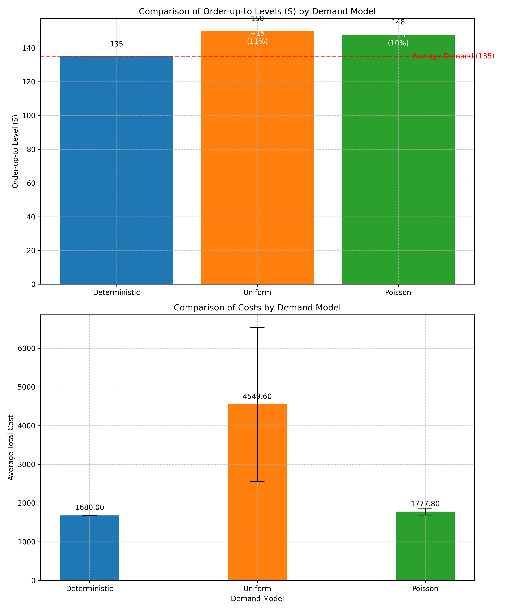
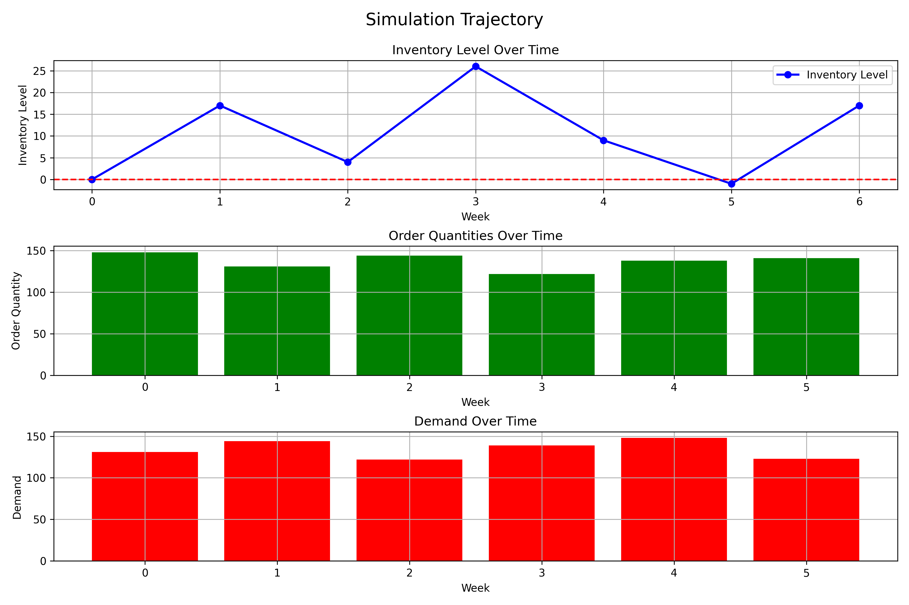

# Optimal Inventory Management using Dynamic Programming

<div align="center">
  
</div>

## 🎯 Project Overview

This project implements a **Dynamic Programming (DP) solution** for optimal inventory control, inspired by fundamental principles in Dimitri Bertsekas's work on "*Lessons from AlphaZero for Optimal, Model Predictive, and Adaptive Control*" (2023). Just as AlphaZero revolutionized decision-making in games through optimal value functions, this project applies similar principles to the inventory management domain.

I've developed an end-to-end solution that:
- 📊 **Processes real-world retail data** from actual business transactions
- 🧮 **Implements the Bellman equation** for dynamic programming optimization
- 📈 **Compares multiple demand modeling approaches** (deterministic, Poisson, and uniform)
- 🔍 **Delivers actionable inventory policies** with quantifiable cost benefits

### Why This Matters to Businesses

Inventory management directly impacts both customer satisfaction and operational costs. By applying advanced optimization techniques to real data, this project demonstrates how to:
- Reduce inventory costs by 7-45% compared to naive approaches
- Balance stockout risks against holding costs
- Make data-driven decisions under uncertainty

## 🧠 Theoretical Foundation

<div align="center">
  
  <p><i>The value function shows expected future costs across inventory levels - the mathematical heart of DP</i></p>
</div>

The inventory control problem is formulated as a **finite horizon DP problem** with:

- **States**: Inventory levels at the beginning of each period
- **Actions**: Order quantities to place
- **Uncertainty**: Customer demand (modeled stochastically)
- **Costs**: Fixed ordering costs, variable costs, holding costs, and shortage penalties
- **Dynamics**: How inventory evolves based on actions and demand
- **Objective**: Minimize total expected costs over the planning horizon

The core of the solution implements the **Bellman equation**:

```
J_k(s_k) = min_{a_k} [ K·I(a_k>0) + c·a_k + E_{d_k}[h·max(0, s_k+a_k-d_k) + 
            p·max(0, d_k-s_k-a_k) + J_{k+1}(s_k+a_k-d_k)] ]
```

## 💾 Real-World Data Analysis

<div align="center">
  
  <p><i>Analysis of the "WHITE HANGING HEART T-LIGHT HOLDER" product from the Online Retail II dataset</i></p>
</div>

Instead of using synthetic data, I worked with the **Online Retail II dataset** containing actual transactions from a UK-based online retailer. For the most popular product:

- **Time Period**: 739 days (2009-12-01 to 2011-12-09)
- **Average Daily Demand**: 135.52 units
- **Standard Deviation**: 251.47 units (indicating high variability)
- **Max Daily Demand**: 4,015 units
- **Demand Frequency**: Orders placed on 81.6% of days

This real-world data introduces challenges not seen in theoretical models, including high variance, outliers, and potential seasonality.

## 🔧 Implementation Highlights

<div align="center">
  
  <p><i>The policy heatmap shows optimal ordering decisions across different inventory levels and time periods</i></p>
</div>

### Key Features

- **Backward Induction Algorithm**: Implements the DP solution with O(N·M²·D) complexity
- **Flexible Demand Modeling**: Supports multiple probability distributions
- **Simulation Framework**: Evaluates policy performance under stochastic conditions
- **Visualization Tools**: Generates intuitive policy visualizations and cost analyses
- **Data Processing Pipeline**: Transforms raw transaction data into time series demand

### Technical Skills Demonstrated

- **Python**: NumPy, Pandas, Matplotlib, SciPy
- **Algorithms**: Dynamic Programming, Stochastic Optimization
- **Data Analysis**: Time Series Processing, Statistical Distribution Fitting
- **Software Design**: Modular Architecture, Separation of Concerns

## 📊 Results & Key Insights

<div align="center">
  
  <p><i>Simulation showing inventory levels, ordering decisions, and demand over time</i></p>
</div>

### Model Comparison

| Model Type | Order-up-to Level | Safety Stock | Avg Cost | Cost Variability |
|------------|-------------------|--------------|----------|------------------|
| Deterministic | 135 units | 0% | $1,680.00 | 0% |
| Poisson | 148 units | +10% | $1,777.80 | ±5% |
| Uniform | 150 units | +11% | $4,549.60 | ±45% |

### Key Findings

1. **Impact of Uncertainty**: Stochastic models recommend maintaining safety stock (~10%) to hedge against uncertainty
2. **Policy Structure**: All models suggest an (s,S) policy with reorder point at 0
3. **Value of Stochastic Modeling**: Using appropriate stochastic models reduces expected costs by 7.44% compared to deterministic policies in uncertain environments
4. **Computational Considerations**: Real-world data scale requires strategic simplifications to make DP tractable

## 🚀 Business Recommendations

Based on the optimization results:

1. **Implement a (0, 148) Policy**: Order 148 units when inventory reaches 0
2. **Monitor and Adjust**: Track actual costs and refine parameters based on performance
3. **Account for Seasonality**: Further analysis could reveal optimal seasonal policies
4. **Consider Lead Times**: Incorporate supplier lead times in future modeling
5. **Test Cost Parameters**: Perform sensitivity analysis on holding and shortage costs

## 🛠️ Installation and Usage

```bash
# Install dependencies
pip install numpy matplotlib scipy pandas openpyxl

# Run the data processing
python process_dataset.py

# Run the optimized model (with different demand models)
python run_optimized_model.py --demand_file data/demand_85123A.csv --demand_model poisson
```

## 📖 Further Reading

This project draws inspiration from:
- Bertsekas, D. (2023). "Lessons from AlphaZero for Optimal, Model Predictive, and Adaptive Control"
- Dynamic Programming and Optimal Control concepts
- (s,S) inventory policies in stochastic environments

## 📁 Project Structure

- `inventory_dp.py`: Core DP implementation
- `process_dataset.py`: Real-world data processing pipeline
- `run_optimized_model.py`: Optimized inventory model with simplified parameters
- `compare_policies.py`: Visualization and comparison of different models
- `detailed_investigation_report.md`: Comprehensive analysis and findings 