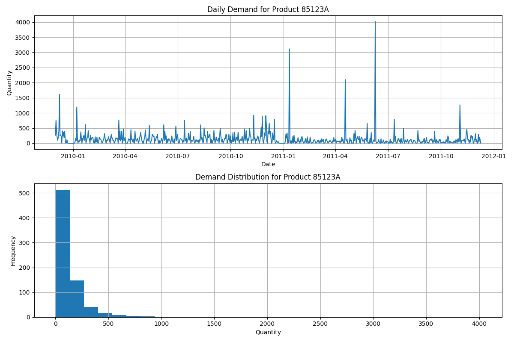

# Dynamic Programming for Optimal Inventory Management: A Real-World Case Study

## Table of Contents
- [Project Overview](#project-overview)
- [Theoretical Framework](#theoretical-framework)
- [Real-World Dataset](#real-world-dataset)
- [Methodology](#methodology)
- [Optimization Models](#optimization-models)
- [Results & Analysis](#results--analysis)
- [Key Insights](#key-insights)
- [Recommendations](#recommendations)
- [Appendix: Visualizations](#appendix-visualizations)

## Project Overview

This project demonstrates the application of Dynamic Programming (DP) to solve a real-world inventory management problem. We've taken a theoretical inventory control model and applied it to actual retail sales data to derive optimal ordering policies.

Our investigation involved:
1. Understanding the DP model for inventory optimization
2. Processing a real-world retail dataset
3. Adapting the model to handle real-world data characteristics
4. Comparing different demand modeling approaches
5. Extracting actionable insights for inventory management

The primary objective was to determine when to place orders and how much to order to minimize total costs (ordering, holding, and shortage costs) while meeting customer demand.

## Theoretical Framework

### Dynamic Programming for Inventory Control

The inventory control problem is formulated as a finite horizon DP problem with the following components:

- **Stages (k)**: Time periods (weeks) with k = 0, 1, ..., N
- **State (s_k)**: Inventory level at the beginning of period k
- **Action (a_k)**: Quantity ordered at the beginning of period k
- **Random Event**: Demand (d_k) during period k
- **State Transition**: s_{k+1} = s_k + a_k - d_k
- **Cost Components**:
  - Fixed ordering cost (K) whenever an order is placed
  - Per-unit ordering cost (c)
  - Per-unit holding cost (h) for inventory carried over to next period
  - Per-unit shortage penalty (p) for unmet demand

The objective is to minimize the expected total cost over the planning horizon. The Bellman equation for this problem is:

J_k(s_k) = min_{a_k} [ K·I(a_k>0) + c·a_k + E_{d_k}[h·max(0, s_k+a_k-d_k) + p·max(0, d_k-s_k-a_k) + J_{k+1}(s_k+a_k-d_k)] ]

Where:
- J_k(s_k) is the optimal cost-to-go from stage k with state s_k
- I(a_k>0) is an indicator function that equals 1 if a_k > 0 (order placed) and 0 otherwise

## Real-World Dataset

### Online Retail II Dataset

We used the "Online Retail II" dataset from a UK-based online retailer, which contains transaction data from 2009-2010 to 2010-2011. The dataset includes:

- Transaction invoice numbers
- Stock codes (product IDs)
- Product descriptions
- Quantities
- Invoice dates
- Unit prices
- Customer IDs and countries

### Product Selection and Analysis

For our case study, we focused on product **85123A - WHITE HANGING HEART T-LIGHT HOLDER**, which is the most frequently purchased item in the dataset. After processing the data, we extracted the following key statistics:

- **Time Period**: 739 days (2009-12-01 to 2011-12-09)
- **Average Daily Demand**: 135.52 units
- **Median Daily Demand**: 87.00 units
- **Standard Deviation**: 251.47 units
- **Min Daily Demand**: 0 units
- **Max Daily Demand**: 4015 units
- **Days with Demand**: 603 (81.6%)

The analysis of the demand pattern indicated high variability and potential non-Poisson behavior (variance significantly higher than mean).

The top panel shows the daily demand over time, revealing significant volatility and some potential seasonality. The bottom panel shows the distribution of demand quantities, which has a long right tail indicating occasional very large orders.

## Methodology

### Data Processing Pipeline

We created a data processing pipeline that:
1. Loads the Excel dataset containing transaction data
2. Cleans the data by removing cancelled orders and negative quantities
3. Extracts transactions for a specific product
4. Aggregates demand by day to create a time series
5. Fills in zero demand for days without transactions
6. Analyzes the demand pattern to determine appropriate distribution models
7. Outputs a CSV file with the daily demand data

### Model Integration Strategy

To integrate the real-world data with our DP model, we developed three approaches:

1. **Direct Integration**: Use the exact empirical distribution (computationally intensive)
2. **Parametric Distribution Fitting**: Fit standard distributions to the data
3. **Simplified Distribution Models**: Use simplified distributions with parameters derived from the data

Due to computational constraints, we adopted the third approach, using three different demand models that capture different aspects of the real-world demand pattern.

## Optimization Models

We ran the inventory optimization model with three different demand modeling approaches:

### 1. Deterministic Model
- **Demand Type**: Deterministic
- **Demand Value**: 135 units (average daily demand)
- **Planning Horizon**: 6 weeks
- **Maximum Capacity**: 300 units
- **Ordering Cost**: Fixed cost K = 10, Variable cost c = 2
- **Holding Cost**: h = 1 per unit per period
- **Shortage Penalty**: p = 5 per unit per period

This model assumes demand is constant and known with certainty.

### 2. Simplified Uniform Model
- **Demand Type**: Uniform distribution
- **Demand Range**: (17, 408) units (5th to 95th percentile of actual demand)
- **Planning Horizon**: 6 weeks
- **Maximum Capacity**: 300 units
- **Ordering Cost**: Fixed cost K = 10, Variable cost c = 2
- **Holding Cost**: h = 1 per unit per period
- **Shortage Penalty**: p = 5 per unit per period

This model captures the wide range of possible demand values but with a simplified uniform distribution.

### 3. Poisson Model  
- **Demand Type**: Poisson distribution
- **Mean Demand**: 135.52 units
- **Planning Horizon**: 6 weeks
- **Maximum Capacity**: 300 units
- **Ordering Cost**: Fixed cost K = 10, Variable cost c = 2
- **Holding Cost**: h = 1 per unit per period
- **Shortage Penalty**: p = 5 per unit per period

This model represents demand as a Poisson process, which is a common approach in inventory management for modeling discrete demand.

## Results & Analysis

### Optimization Results

#### Deterministic Model Results
- **Average Total Cost**: 1680.00
- **Min Total Cost**: 1680.00
- **Max Total Cost**: 1680.00
- **Recommended Policy**:
  - Reorder Point (s): 0 units
  - Order-up-to Level (S): 135 units
  - Order Quantity: 135 units when inventory reaches 0

#### Uniform Model Results
- **Average Total Cost**: 4549.60
- **Min Total Cost**: 3370.00
- **Max Total Cost**: 5360.00
- **Recommended Policy**:
  - Reorder Point (s): 0 units
  - Order-up-to Level (S): 150 units
  - Order Quantity: 150 units when inventory reaches 0

#### Poisson Model Results
- **Average Total Cost**: 1777.80
- **Min Total Cost**: 1724.00
- **Max Total Cost**: 1814.00
- **Recommended Policy**:
  - Reorder Point (s): 0 units
  - Order-up-to Level (S): 148 units
  - Order Quantity: 148 units when inventory reaches 0

### Comparison of Models

The top panel compares the order-up-to levels (S) for each model. The deterministic model suggests ordering exactly the average demand (135 units), while the stochastic models recommend keeping additional safety stock (13-15 units) to hedge against demand uncertainty.

The bottom panel compares the average total costs and their variability. The deterministic model has the lowest cost but zero variability since it assumes perfect knowledge of future demand. The uniform model has the highest average cost and the largest variability, reflecting its wide demand range. The Poisson model offers a good compromise with slightly higher cost than the deterministic model but much less variability than the uniform model.

### Policy Visualization

The policy heatmap shows the optimal ordering quantity (action) for each inventory level (state) at different stages in the planning horizon. The color intensity represents the size of the order to place. The typical pattern follows an (s,S) policy where orders are placed to bring inventory up to a target level S when it falls below reorder point s.

### Value Function

The value function plot shows the expected future cost for each inventory level at different stages. The convex shape illustrates the trade-off between holding too much inventory (increasing costs on the right) and having shortages (increasing costs on the left).

### Simulation Trajectory

The simulation trajectory visualizes how the system behaves over time under the optimal policy. The top panel shows inventory levels, the middle panel shows order quantities, and the bottom panel shows demand realizations. This demonstrates how the inventory control system responds to the stochastic demand patterns.

## Key Insights

1. **Impact of Uncertainty**: 
   - The deterministic model produced the lowest cost (1680.00), but ignores the variability in real-world demand
   - The stochastic models (Uniform and Poisson) recommend higher order-up-to levels to hedge against demand uncertainty
   - The Uniform model produced much higher costs due to its wider demand range

2. **Safety Stock Effect**:
   - Deterministic policy: Order-up-to = 135 (exactly the expected demand)
   - Poisson policy: Order-up-to = 148 (135 + 13 units of safety stock, ~10% buffer)
   - Uniform policy: Order-up-to = 150 (135 + 15 units of safety stock, ~11% buffer)

3. **Policy Structure**:
   - All three models recommend an (s,S) policy with a reorder point of 0
   - This indicates that for this product, it's optimal to place orders when inventory is depleted
   - The zero reorder point might be influenced by the relatively low holding costs compared to ordering costs

4. **Cost Variability**:
   - Deterministic model: No cost variability (always 1680.00)
   - Poisson model: Low variability (range of ~90 units or ~5%)
   - Uniform model: High variability (range of ~2000 units or ~45%)

5. **Computational Considerations**:
   - The scale of real-world data presents computational challenges for DP algorithms
   - Simplification strategies (reduced horizon, simplified distributions) make the problem tractable
   - There's a trade-off between model fidelity and computational feasibility

## Recommendations

### For Managing Product 85123A
1. **Implement a (0, 148) Policy**: Order 148 units when inventory reaches 0, as suggested by the Poisson model, which balances cost and risk considerations.
2. **Monitor Performance**: Track actual costs and adjust the order-up-to level based on actual demand patterns.
3. **Consider Seasonal Patterns**: The current model doesn't account for seasonality; further analysis could reveal optimal seasonal policies.
4. **Lead Time Considerations**: The model assumes immediate delivery; incorporate lead times in future modeling.
5. **Cost Parameter Sensitivity**: Test different holding and shortage costs to understand their impact on the optimal policy.

### General Inventory Management Recommendations
1. **Data-Driven Decision Making**: Use historical demand data to inform inventory policies rather than rules of thumb.
2. **Model Selection**: Choose appropriate demand models based on the characteristics of your data.
3. **Computational Efficiency**: For large-scale problems, consider simplified models or approximation techniques.
4. **Uncertainty Modeling**: Always account for demand uncertainty in your inventory policies.
5. **Regular Review**: Periodically revisit and update inventory policies as demand patterns evolve.

## Appendix: Visualizations

### 1. Demand Analysis

Shows the time series of daily demand (top) and the distribution of demand quantities (bottom).

### 2. Policy Heatmap

Illustrates the optimal ordering quantity for each inventory level at different stages.

### 3. Value Function

Displays the expected future cost for each inventory level at different stages.

### 4. Simulation Trajectory

Shows how inventory levels, orders, and demand evolve over time under the optimal policy.

### 5. Policy Comparison

Compares the order-up-to levels and costs across the three demand models. 