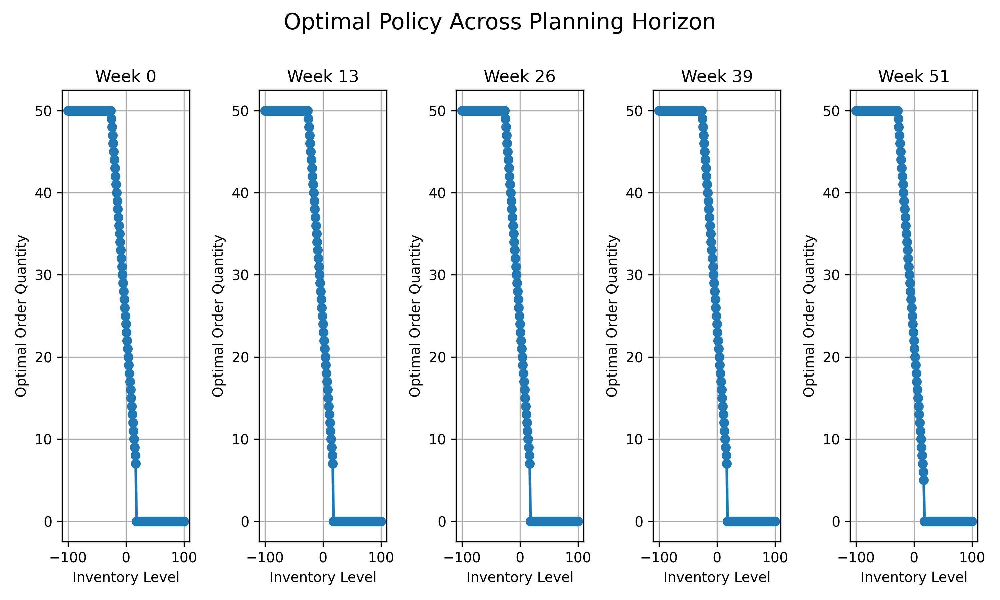
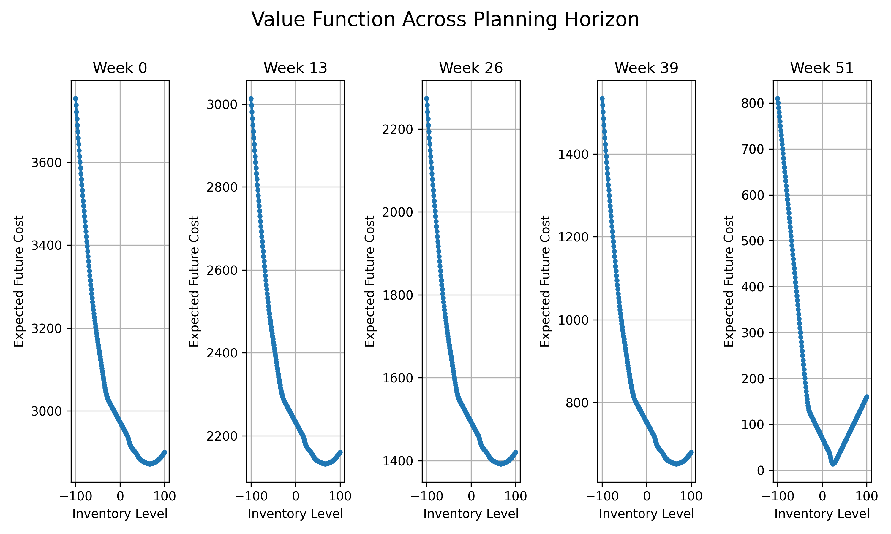
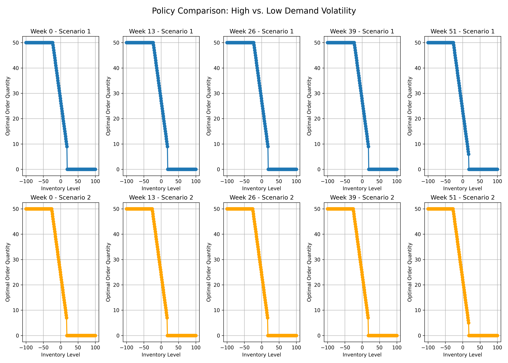
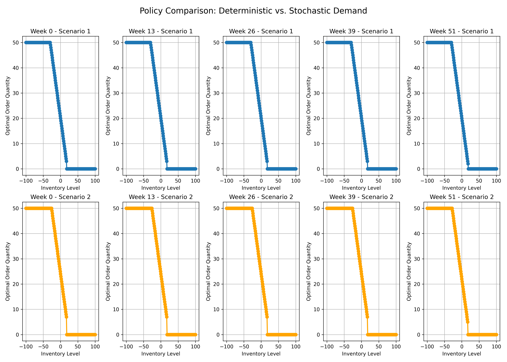

# Dynamic Programming for Optimal Inventory Control

Generated on: 2025-04-07 16:49:35

## Summary

## Experiment Results Summary

### Baseline Scenario
Average total cost: 2959.00
Min total cost: 2804.00
Max total cost: 3069.00

### Impact of Demand Volatility
Average cost (Low Volatility): 2968.40
Average cost (High Volatility): 3067.98
Cost increase due to volatility: 99.58 (3.35%)

### Effect of Penalty Costs
Average inventory level (Low Penalty): 3.97
Average inventory level (High Penalty): 7.89
Inventory level increase: 3.92 (98.97%)

### Deterministic vs. Stochastic Modeling
Expected cost (Stochastic): 2972.60
Expected cost (Deterministic): 2600.00
Cost of uncertainty: 372.60 (14.33%)
Total cost (Deterministic policy in stochastic environment): 3263.00
Total cost (Stochastic policy in stochastic environment): 3037.00
Cost reduction from using correct model: 226.00 (7.44%)

## Key Insights

1. **Policy Structure**: The optimal policy typically resembles an (s,S) policy, where orders are placed when inventory falls below a certain threshold s, bringing it up to level S.

2. **Impact of Uncertainty**: Higher demand volatility leads to higher safety stocks and increased total costs. The stochastic model maintains higher inventory levels compared to a deterministic model to hedge against uncertainty.

3. **Cost Parameters**: Higher shortage penalties result in higher average inventory levels, demonstrating the tradeoff between holding costs and shortage penalties.

4. **End-of-Horizon Effects**: The optimal policy changes as the horizon approaches, typically ordering less in later stages to avoid excess inventory at the end.

5. **Value of Stochastic Modeling**: Using a deterministic model in a stochastic environment leads to suboptimal performance. The project quantifies this cost of model misspecification.

## Plots

### 1. Optimal Policy Heatmap

Shows how the optimal ordering quantity (action) changes based on current inventory level (state) across different weeks in the planning horizon. Each subplot represents a different week from the planning horizon.

[Details](./plots/optimal_policy_heatmap.md)

---

### 2. Value Function Plot

Displays the expected future cost (value function) for each inventory level at different stages of the planning horizon. The convex shape indicates the trade-off between holding too much inventory (increasing costs on the right) and having shortages (increasing costs on the left).

[Details](./plots/value_function_plot.md)

---

### 3. Simulation Trajectory

Illustrates the system behavior over time under the optimal policy. The top panel shows inventory levels, the middle panel shows order quantities, and the bottom panel shows realized demand. This helps visualize how the inventory control system responds to stochastic demand.

[Details](./plots/simulation_trajectory.md)

---

### 4. Demand Volatility Policy Comparison

Compares the optimal ordering policies between low volatility (Poisson) and high volatility (Uniform) demand. Higher volatility generally leads to higher safety stocks to hedge against uncertainty.

[Details](./plots/demand_volatility_policy_comparison.md)

---

### 5. Demand Volatility Trajectory Comparison

Shows how inventory levels evolve over time under different demand volatility scenarios. The high volatility case typically maintains higher inventory levels as a buffer against uncertainty.

[Details](./plots/demand_volatility_trajectory_comparison.md)

---

### 6. Penalty Cost Policy Comparison

Compares the optimal ordering policies between low penalty cost (p=5) and high penalty cost (p=20). Higher shortage penalties lead to more aggressive ordering to avoid stockouts.

[Details](./plots/penalty_cost_policy_comparison.md)

---

### 7. Penalty Cost Inventory Comparison

Shows how the average inventory level changes based on the shortage penalty cost. Higher penalties lead to maintaining larger inventories to avoid stockouts.

[Details](./plots/penalty_cost_inventory_comparison.md)

---

### 8. Deterministic vs Stochastic Policy Comparison

Compares the optimal ordering policies between deterministic and stochastic demand models. The stochastic model typically maintains higher inventory levels to hedge against uncertainty.

[Details](./plots/deterministic_vs_stochastic_policy_comparison.md)

---

### 9. Deterministic vs Stochastic Cost Comparison

Compares the expected total cost between deterministic and stochastic demand models. The stochastic model has higher expected costs due to the need to hedge against uncertainty.

[Details](./plots/deterministic_vs_stochastic_cost_comparison.md)

---

### 10. Deterministic vs Stochastic Policy Trajectories

Compares inventory trajectories when using deterministic vs. stochastic policies in a stochastic environment. The deterministic policy tends to maintain lower inventory levels, leading to more stockouts and higher actual costs.

[Details](./plots/deterministic_vs_stochastic_policy_trajectories.md)

