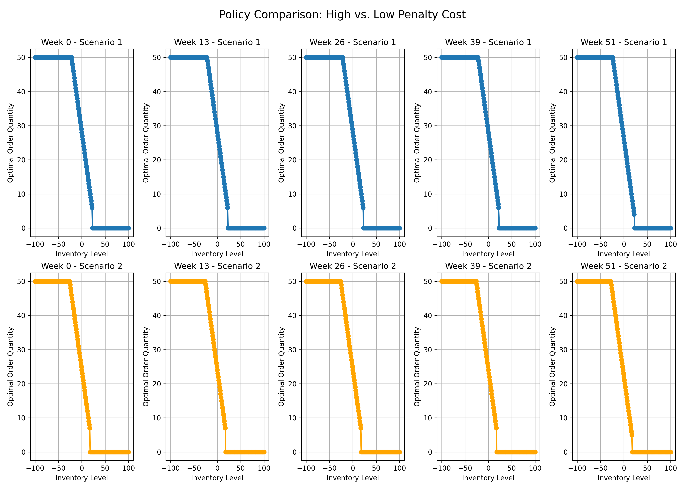

# Penalty Cost Policy Comparison

## Description

Compares the optimal ordering policies between low penalty cost (p=5) and high penalty cost (p=20). Higher shortage penalties lead to more aggressive ordering to avoid stockouts.

## Experiment Details

Comparison between:
1. Low shortage penalty: p=5
2. High shortage penalty: p=20

Both models use:
- Planning horizon: 52 weeks
- Maximum warehouse capacity: 100 units
- Maximum order size: 50 units
- Fixed ordering cost (K): 10
- Per-unit ordering cost (c): 2
- Per-unit holding cost (h): 1
- Poisson demand with mean 20

Generated on: 2025-04-07 16:49:13
