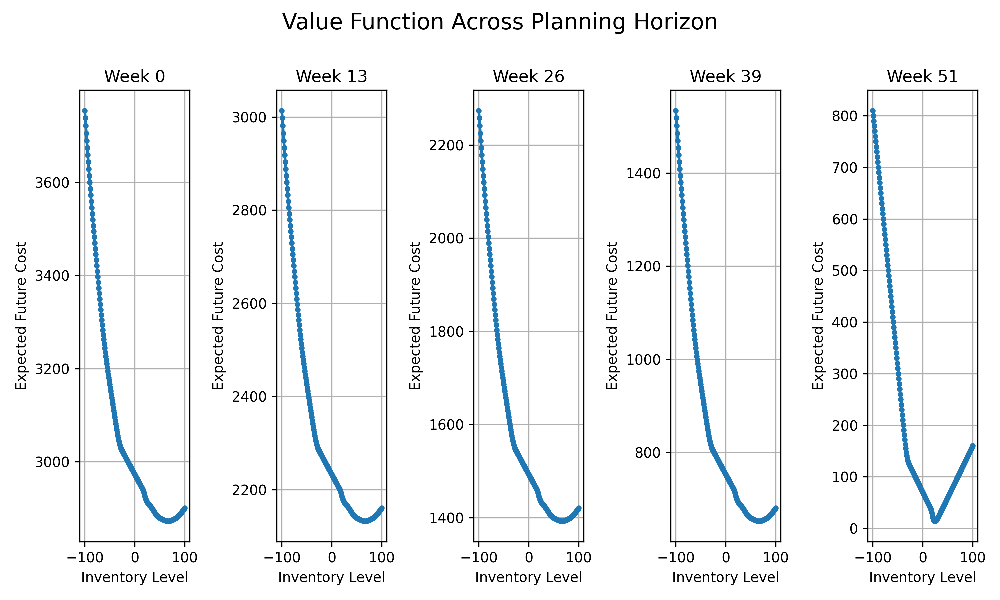

# Value Function Plot

## Description

Displays the expected future cost (value function) for each inventory level at different stages of the planning horizon. The convex shape indicates the trade-off between holding too much inventory (increasing costs on the right) and having shortages (increasing costs on the left).

## Experiment Details

Parameters:
- Planning horizon: 52 weeks
- Maximum warehouse capacity: 100 units
- Maximum order size: 50 units
- Fixed ordering cost (K): 10
- Per-unit ordering cost (c): 2
- Per-unit holding cost (h): 1
- Per-unit shortage penalty (p): 5
- Demand follows Poisson distribution with mean 20

Generated on: 2025-04-07 16:48:10
