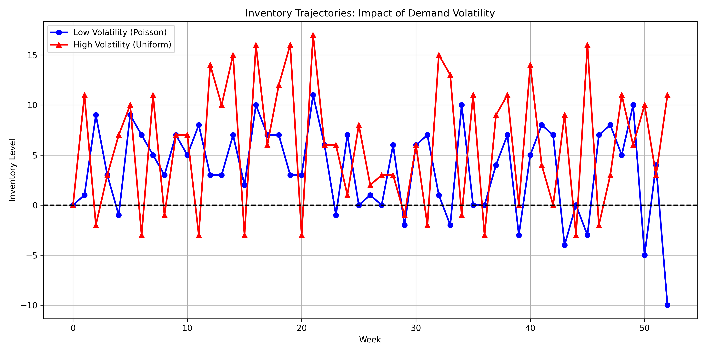

# Demand Volatility Trajectory Comparison

## Description

Shows how inventory levels evolve over time under different demand volatility scenarios. The high volatility case typically maintains higher inventory levels as a buffer against uncertainty.

## Experiment Details

Comparison between:
1. Low volatility: Poisson demand with mean 20
2. High volatility: Uniform demand between 10 and 30 (same mean of 20 but higher variance)

Both models use:
- Planning horizon: 52 weeks
- Maximum warehouse capacity: 100 units
- Maximum order size: 50 units
- Fixed ordering cost (K): 10
- Per-unit ordering cost (c): 2
- Per-unit holding cost (h): 1
- Per-unit shortage penalty (p): 5

Generated on: 2025-04-07 17:02:53
