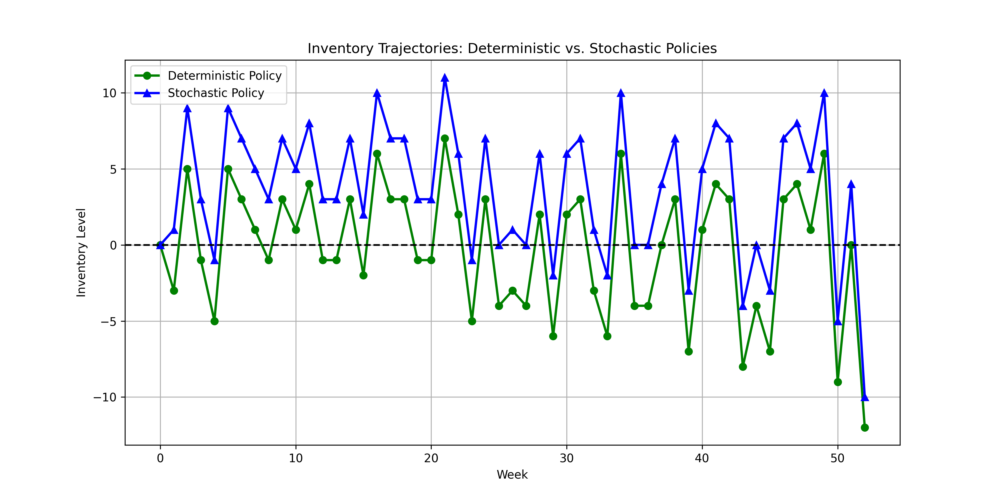

# Deterministic vs Stochastic Policy Trajectories

## Description

Compares inventory trajectories when using deterministic vs. stochastic policies in a stochastic environment. The deterministic policy tends to maintain lower inventory levels, leading to more stockouts and higher actual costs.

## Experiment Details

Comparison between:
1. Stochastic model: Poisson demand with mean 20
2. Deterministic model: Fixed demand of 20 units each week

Both models use:
- Planning horizon: 52 weeks
- Maximum warehouse capacity: 100 units
- Maximum order size: 50 units
- Fixed ordering cost (K): 10
- Per-unit ordering cost (c): 2
- Per-unit holding cost (h): 1
- Per-unit shortage penalty (p): 5

Generated on: 2025-04-07 17:03:49
