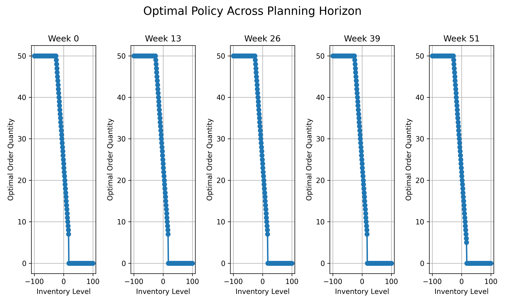

# Optimal Policy Heatmap

## Description

Shows how the optimal ordering quantity (action) changes based on current inventory level (state) across different weeks in the planning horizon. Each subplot represents a different week from the planning horizon.

## Experiment Details

Parameters:
- Planning horizon: 52 weeks
- Maximum warehouse capacity: 100 units
- Maximum order size: 50 units
- Fixed ordering cost (K): 10
- Per-unit ordering cost (c): 2
- Per-unit holding cost (h): 1
- Per-unit shortage penalty (p): 5
- Demand follows Poisson distribution with mean 20

Generated on: 2025-04-07 17:02:21
