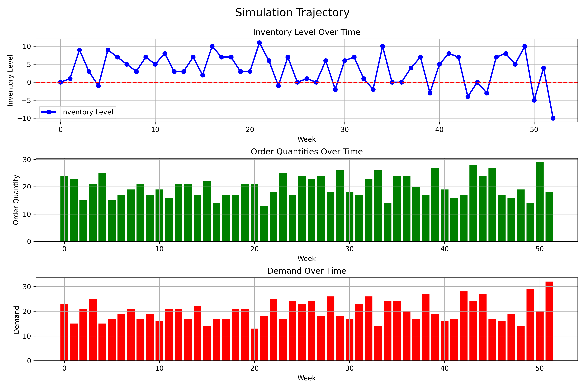

# Simulation Trajectory

## Description

Illustrates the system behavior over time under the optimal policy. The top panel shows inventory levels, the middle panel shows order quantities, and the bottom panel shows realized demand. This helps visualize how the inventory control system responds to stochastic demand.

## Experiment Details

Parameters:
- Planning horizon: 52 weeks
- Maximum warehouse capacity: 100 units
- Maximum order size: 50 units
- Fixed ordering cost (K): 10
- Per-unit ordering cost (c): 2
- Per-unit holding cost (h): 1
- Per-unit shortage penalty (p): 5
- Demand follows Poisson distribution with mean 20

Simulation details:
- 10 simulation runs
- Initial inventory: 0 units
- Random seed: 42
- Average total cost: 2959.00
Min total cost: 2804.00
Max total cost: 3069.00

Generated on: 2025-04-07 17:02:24
